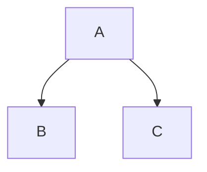

# Peekaboo Kitchen Sink

A fixture exercising everything Peekaboo renders. :rocket:

## Math

Inline math: $e^{i\pi} + 1 = 0$ and $\nabla \cdot \mathbf{u} = 0$.

Display math:

$$
\frac{\partial u}{\partial t} = \alpha \nabla^2 u
$$

Math fence:

```math
\int_\Omega \nabla u \cdot \nabla v \, d\Omega = \int_\Omega f v \, d\Omega
```

Single-line display: $$E = mc^2$$

Not math: it costs $5 and $10 at the store.

## Code

```julia
function rbf_interp(x, centers, w; ε=2.0)
    # Gaussian kernel — $ should stay literal here: $not math$
    return sum(w[i] * exp(-ε^2 * norm(x - centers[i])^2) for i in eachindex(w))
end
```

Inline code with dollars: `price = $42` and ``nested `$` tick``.

## GFM

| Feature | Status |
| --- | --- |
| Tables | ~~broken~~ works |
| Math | works |

- [x] Task one
- [ ] Task two

Autolink: https://github.com/KaTeX/KaTeX

Footnote reference.[^1]

[^1]: The footnote text.

## Alerts

> [!NOTE]
> Useful information that users should know.

> [!WARNING]
> Critical content demanding attention.

> Plain blockquote, not an alert.

## Mermaid



## Emoji

:tada: :+1: :heart: and an unknown one :notarealemoji:.
